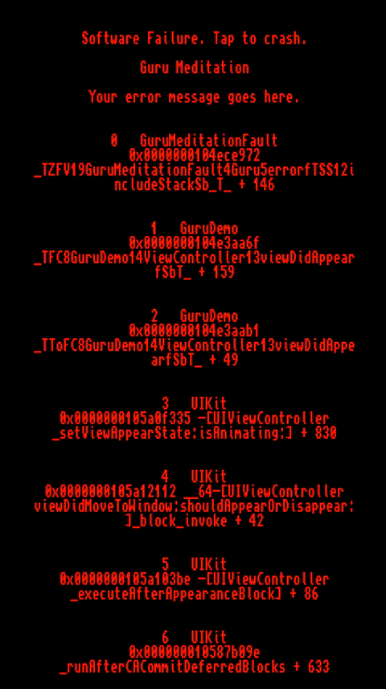
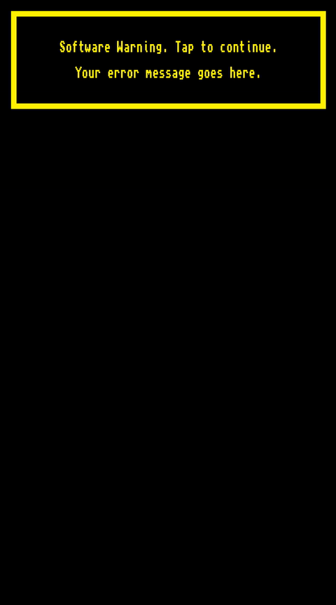

#GuruMeditation
[](#)
[](https://github.com/Carthage/Carthage)
[](#)
[](https://opensource.org/licenses/MIT)

[Nostalgic](https://en.wikipedia.org/wiki/Guru_Meditation) error screen for iOS.




## Installation

### Carthage


To install Carthage, run (using Homebrew):

	$ brew update
	$ brew install carthage	

Then add the following line to your `Cartfile`:

	github "alexdrone/GuruMeditation" "master"    


#### CocoaPods
TODO

#### Manually
All the source code is in a single file.

#Usage

```swift

import GuruMeditation

...

// Simple warning message.
Guru.warning("Your error message goes here.")

// Completion when the error screen get dismissed.
Guru.warning("Your error message goes here.") {
	//do something.
}

// Includes the stack trace in the warning screen.
Guru.warning("Your error message goes here.", includeStack: true)

// Crashes the application after the user tap the screen.
Guru.error("Error message.")


``` 